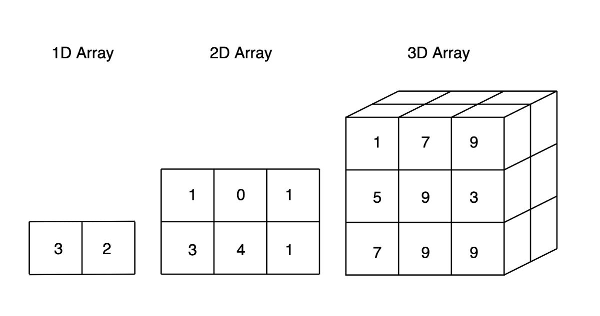

# Array

## 1. Permasalahan

Sebelumnya di [Variabel dan Tipe Data](materi/basic/variabeltipedata.md) sudah dibahas bahwa variable untuk menyimpan data sementara bukan?, tetapi kelemahan variable seperti itu adalah hanya dapat menyimpan 1 data saja per variable

```java
// Contoh

String nama = "Bejo";
```

Bagaimana jika ingin menyimpan banyak data?, tentu jika menggunakan variable seperti diatas akan membuat banyak variable, hal ini sangat tidak efektif.

```java
// Contoh
String nama = "Bejo";
String nama2 = "Tiwi";
String nama3 = "Clark";
String nama4 = "Foo";
String nama5 = "Bar";
```

Lihat sangat tidak efektif bukan?, maka untuk mengatasi masalah ini hadirlah Array sebagai solusi.

## 2. Pengenalan Array

Array merupakan variabel spesial yang dapat menyimpan banyak nilai sekaligus, bayangkan array adalah sebuah loker, loker dapat menyimpan banyak barang karena memiliki banyak pintu, masing - masing pintu memiliki nomor agar kita tidak bingung dimana kita menyimpan barang kita sebelumnya.


Sama seperti loker, array juga memiliki banyak index (pintu) dimana masing - masing index memiliki nomor index (nomor pintu), ketika ingin mengambil data dari sebuah array kita harus tau di index keberapa kita menyimpan data tersebut, biasanya index dimulai dari angka 0.


## 3. Penjelasan Array

### 3.1 Deklarasi Array

Untuk deklarasi Array caranya mirip dengan deklarasi variable pada umumnya, hanya saja perbedaannya Array ada tambahan `[]` setelah tipe data

```java
// Contoh

String[] nama;
```

Kita juga dapat juga mendeklarasi array dan menetapkan alokasi memory yang dapat digunakan oleh array tersebut tanpa memasukkan data telebih dahulu.

```java
// Contoh
String[] nama = new String[4];
```

Kita juga dapat untuk langsung memasukkan data kedalam array saat deklrasi array tersebut?, caranya adalah data tersebut dibungkus dengan `{}` dan dipisahkan dengan `,`.

```java
// Contoh

String[] nama = {"Bejo", "Foo", "Bar", "Tiwi"};
```

Kita juga dapat memasukkan data pada setiap index array dengan cara mirip seperti variable biasa yang menjadi pembeda adalah terdapat tambahan `[index]` seperti `[2]` setelah nama variable

```java
// Contoh

String[] nama = new String[3];

nama[0] = "Foo";
nama[1] = "Bar";
nama[2] = "Bejo";
```

### 3.2 Akses Array

Setelah kita paham bagaimana cara mendeklarasikan Array muncul pertanyaan selanjutnya, Bagaimana kita mengakses data tersebut, misal hanya mau mengambil `Foo` saja. Caranya adalah sesuai pada pengenalan array diatas, dengan menggunakan Index yang dimulai dari `0`, Contoh implementasi pada kode program:

```java
// Contoh

String[] nama = {"Bejo", "Foo", "Bar", "Tiwi"};

System.out.println(nama[1]);
```

```bash
Output:
Foo
```

Yang menjadi output adalah `Foo`

Kenapa?

Karena Indeks array dimulai dari 0 sehingga Indeks `ke-0` adalah `Bejo`, kemudian indeks nama `ke-1` adalah `Foo` dst

Kita sekarang sudah bisa mengakses data array, tetapi muncul masalah baru, jika kita ingin mengeluarkan banyak data sekaligus jika menggunakan `print` sangat tidak efisien dan tidak dinamis

```java
// Contoh

String[] nama = {"Bejo", "Foo", "Bar", "Tiwi"};

System.out.println(nama[0]);
System.out.println(nama[1]);
System.out.println(nama[2]);
System.out.println(nama[3]);
```

```bash
Output:
Bejo
Foo
Bar
Tiwi
```

Untuk membuat dinamis dan efisien dapat menggunakan `Looping` yang telah dipelajari sebelumnya

```java
// Contoh
String[] nama = {"Bejo", "Foo", "Bar", "Tiwi"};

for (int i = 0; i < nama.length; i++) {
  System.out.println(nama[i]);
}
```

```bash
Output:
Bejo
Foo
Bar
Tiwi
```

jadi lebih efisien bukan?

### 3.3 Multidimensional Array



Multidimensional array ini adalah Array berisi Array, untuk mendklasikan Array multidimensional mirip dengan array 1D hanya saja ditambahkan `[]` lagi sesuai dimensi yang diinginkan

```java
// Contoh

// 1D Array
int[] myNum;

// 2D Array
int[][] myNum;

// 3D Array
int[][][] myNum;
```

Untuk mengakses array multidimensional ini mirip seperti array 1D biasa namun berbeda pada index yang akan dituju tidak dapat hanya memberikan 1 indeks saja harus sesuai dimensi yang dideklarasikan

```java
// Contoh

int[][] myNum = { {1,2,3}, {4,5,6} };

// Akses Array

System.out.println(myNum[0][2]);
```

```bash
Output:
3
```

Hasilnya `3` dikarenakan multidimensional array memiliki konsep mirip seperti baris dan kolom, sehingga indeks baris 0 dan kolom 2 adalah angka 3

Multidimensional Array dapat juga diakses secara dinamis dan otomatis deng mengimplementasikan nested loop

```java
// Contoh

int[][] myNum = {{1, 2, 3}, {4, 5, 6}};

for (int i = 0; i < myNum.length; i++) {
    for (int j = 0; j < myNum[i].length; j++) {
        System.out.println(myNum[i][j]);
    }
}
```

```bash
Ouput:
1
2
3
4
5
6
```
