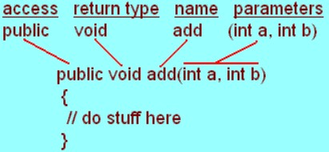

# Fungsi

## 1. Permasalahan

Pada pembahasan sebelumnya kita telah membuat berbagai contoh program, namun pada semua program yang telah kita buat kita hanya menggunakan suatu fungsi saja yaitu fungsi `main()`. Pada java secara default akan selalu ada fungsi `main()` dimana pada fungsi ini nantinya digunakan untuk menjalankan semua kode yang ada didalamnya. Pada kasus pembuatan program sederhana menggunakan fungsi `main()` sebenarnya tidak masalah, namun saat kita membuat program berskala besar tentunya akan sulit. Jika kita meletakkan semua kode pada fungsi `main()` maka akan sulit jika ada kesalahan atau error, sulit saat mengerjakan proyek bersama (Kolaborasi) karena yang diajak kolab pastinya juga bingung jika semua kode diletakkan pada fungsi `main()`.

## 2. Penjelasan Materi Sebagai Solusi

Permasalahan diatas dapat kita atasi dengan menggunakan fungsi/prosedur. Prosedur merupakan fungsi yang tidak mengembalikan atau tidak mereturn sebuah nilai (void), lalu jika fungsi adalah sebuah fungsi yang mereturn atau mengembalikan sebuah nilai. Fungsi/prosedur sendiri nantinya akan kita gunakan untuk membagi program kita menjadi sub-sub program sehingga program yang kita buat lebih enak untuk dibaca dan efisien pengkodingannya maksut dari efisien sendiri adalah mengurangi pengetikan kode secara berulang pada program kita dan kode yang kita ketik sudah terbagi menjadi beberapa kelompok (fungsi/prosedur).

Struktur dari fungsi sendiri seperti gambar dibawah ini.

;

Public merupakan suatu access modifier , bisa kita set atau kita ubah menjadi private, protected atau dikosongi alias default. Untuk jenis jenis dan pengertian access modifier lebih lengkapnya kalian bisa baca pada materi berikut [Klik Disini](https://github.com/wrideveloper/roadmap-programming/blob/master/materi/oop/access-modifier.md). Return type kita set sesuai kebutuhan, semisal kita ingin membuat suatu program yang nantinya mengembalikan sebuah nilai bertipe integer maka kita set tipe data dari suatu fungsi int `int hitungPersegi(int sisi)`, jika kita ingin menggunakan double maka kita ganti saja ke double, dan seterusnya. Untuk nama dari sebuah fungsi bebas namun ada harus jelas mendeskripsikan fungsinya agar nantinya kita dapat dengan mudah memahami sebuah fungsi hanya dari namanya. Contoh `int hitungPersegi(int sisi)` dari namanya saja kalian tau kan fungsi ini nantinya untuk menghitung persegi. Untuk bagian parameter kalian juga bisa tambahkan sesuai kebutuhan, jika menghitung luas persegi yang kita butuhkan adalah sisi, maka kita akan menambahkan parameter sisi pada fungsi yang telah kita buat.

## 3. Penjelasan Detail Materi

Saat kita ingin membuat sebuah fungsi kita harus meletakkan fungsi tersebut kedalam sebuah class. Contoh dari struktur fungsi adalah sebagai berikut

```java
static void greetings(){
    System.out.println("Hello, welcome to my program");
}

public static void main(String[] args) {
    greetings();
}
```

```bash
Output :
Hello, welcome to my program
```

Pada contoh kode diatas kita membuat suatu fungsi static dimana fungsi ini nantinya tidak memerlukan instansiasi objek, jadi jika kita membutuhkan fungsi ini tinggal dipanggil saja. Sedangkan `void` sendiri merupakan tipe data kembalian setelah fungsi dieksekusi. Lalu kita dapat memanggil fungsi statis pada class main. Jika kita ingin membuat suatu fungsi yang tidak status maka kita perlu suatu instansiasi, mari kita coba untuk program penambahan, kita nantinya akan mereturn sebuah data integer berupa hasil penambahan 2 buah angka. Contohnya sebagai berikut.

```java
int penambahan(int num1, int num2){
    return num1+num2;
}

public static void main(String[] args) {
    Fungsi1 f1 = new Fungsi1();

    System.out.print(f1.penambahan(4, 5));
}
```

```bash
Output :
9
```

Pada kode diatas jika kita tau bahwa penggunaan tipe data sebuah class harus sesuai kebutuhan. Kita juga bisa menambahkan parameter pada fungsi yang telah kita buat, disini saya membutuhkan 2 parameter karena nantinya kita akan menjumlahkan 2 buah angka. Lalu jika tidak menggunakan static fungsi maka kita perlu instansiasi objek terlebih dahulu. Maksut dari instansiasi sendiri adalah kode berikut `Fungsi1 f1 = new Fungsi1();` kita membuat suatu objek supaya kita bisa menggunakan atau mengambil sebuah nilai dari suatu objek yang telah kita instansiasi tadi.

## 4. Contoh Kode Program

Mari kita implementasikan materi diatas dengan membuat suatu program. Disini kita akan membuat suatu program menghitung lingkaran.

```java
import java.util.Scanner;
public class Lingkaran1 {
    static double phi = 3.14;
    static double luas(double r){
        double luasLingkaran = phi * r * r;
        return luasLingkaran;
    }

    double keliling(double r){
        double kelilingLingkaran = 2 * phi * r;
        return kelilingLingkaran;
    }

    static void greetings(String waktu){
        System.out.println("Halo, selamat "+waktu);
    }

    public static void main(String[] args) {
        Scanner sc = new Scanner(System.in);

        Lingkaran1 l1 = new Lingkaran1();

        greetings("Pagi");

        System.out.print("Masukkan Jari Jari Lingkaran > " );
        double r = sc.nextDouble();

        System.out.println("Luas Lingkaran : "+luas(r));
        System.out.println("Keliling Lingkaran : "+l1.keliling(r));
    }
}
```

Pada program diatas kita menerapkan fungsi statis maupun non statis, lalu kita juga dapat mengetahui bahwa fungsi void pun bisa kita beri sebuah parameter. Penggunaan fungsi memudahkan saat kita melakukan kolaborasi, teman kita hanya perlu membaca fungsi main lalu melihat fungsi fungsi yang telah kita buat. Fungsi nya pun terkelompok atau terbagi sesuai dengan kebutuhan. Semisal fungsi luas, jika fungsi luas error maka kita akan mudah melakukan tracing, brarti pada fungsi luas saja yang kita cek kodingannya. Tidak perlu melakukan pengecekan satu satu pada fungsi main.
