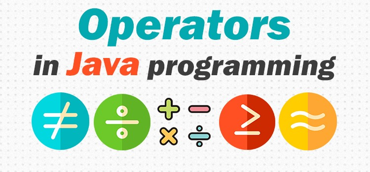

# Operator



## 1. Pendahuluan

Setelah mengenal input dan output alangkah baiknya kita mulai mengenal operator. Java sendiri memiliki 4 jenis operator yang sering digunakan untuk membuat suatu program. Apa itu operator? Operator merupakan suatu simbol" yang nantinya digunakan mengoperasikan suatu data. Misalnya kita ingin melakukan sum x dan y maka kita menggunakan operator + lalu jika ingin mendapatkan sisa bagi dari suatu data kita menggunakan % dan seterusnya.

Operator yang paling sering digunakan :

1. Arithmetic Operator
2. Assignment Operator
3. Relational Operator
4. Logical Operator

## 2. Penjelasan Mengenai Operator

### 2.1 Arithmetic Operator

Arithmetic Operator atau Operator Aritmatika adalah operator yang biasa kita gunakan saat melakukan proses perhitungan matematika, berikut jenis jenis operator aritmatika.

- (+) = Tambah
- (-) = Kurang
- (\*) = Kali
- (/) = Bagi
- (%) = Modulus (Sisa Bagi)

Tentunya kalian sudah sering mendapati operator ini saat menggunakan kalkulator, jadi fungsi atau pengertian dari operator ini cukup jelas.

### 2.2 Assignment Operator

Assignment Operator atau Operator Penugasan ini memiliki fungsi untuk memberikan suatu tugas kepada variabel/data. Contohnya seperti potongan kode berikut

```java
int num = 29;
```

Pada kode diatas `=` berfungsi untuk memberikan nilai variabel num nilai 29. Berikut tabel informasi mengenai assignment operator yang paling sering digunakan.

| Operator | Deskripsi                                                                                      | Contoh                                           |
| -------- | ---------------------------------------------------------------------------------------------- | ------------------------------------------------ |
| =        | Memberikan nilai dari variabel kiri ke kanan                                                   | A = 1 berarti memberikan nilai 1 pada variabel A |
| +=       | Menambah nilai dari variabel kiri ke kanan dan menetapkan nilainya ke variabel sebelah kiri    | A += 1 berarti A = A + 1                         |
| -=       | Mengurangi nilai dari variabel kiri ke kanan dan menetapkan nilainya ke variabel sebelah kiri  | A -= 1 berarti A = A - 1                         |
| \*=      | Mengkalikan nilai dari variabel kiri ke kanan dan menetapkan nilainya ke variabel sebelah kiri | A \*= 1 berarti A = A \* 1                       |
| /=       | Membagi nilai dari variabel kiri ke kanan dan menetapkan nilainya ke variabel sebelah kiri     | A /= 1 berarti A = A / 1                         |

### 2.3 Relational Operator

Relational Operator atau Operator Relasional ini merupakan operator untuk membandingkan antara dua buah data atau variabel dan hasil dari perbandingan ini nantinya memiliki tujuan, jika memenuhi kondisi A maka akan lanjut pada Step B, dst. Setelah materi ini kita akan belajar lebih dalam tentang operator ini, umumnya digunakan saat melakukan coding if else. Berikut jenis jenis operator relasional.

| Operator | Deskripsi                                                                                                                      |
| -------- | ------------------------------------------------------------------------------------------------------------------------------ |
| >        | Pengecekan nilai variabel kiri lebih besar dari nilai variabel kanan, jika iya berarti nilai TRUE jika tidak maka FALSE        |
| <        | Pengecekan nilai variabel kiri lebih kecil dari nilai variabel kanan, jika iya berarti nilai TRUE jika tidak maka FALSE        |
| ==       | Pengecekan nilai variabel kiri sama dengan nilai variabel kanan, jika iya berarti nilai TRUE jika tidak maka FALSE             |
| !=       | Pengecekan nilai variabel kiri tidak sama dengan nilai variabel kanan, jika iya berarti nilai TRUE jika tidak maka FALSE       |
| >=       | Pengecekan nilai variabel kiri lebih besar sama dengan nilai variabel kanan, jika iya berarti nilai TRUE jika tidak maka FALSE |
| <=       | Pengecekan nilai variabel kiri lebih kecil sama dengan nilai variabel kanan, jika iya berarti nilai TRUE jika tidak maka FALSE |

### 2.4 Logical Operator

Logical Operator atau Operator Logika ini cukup mudah jika kita menggunakan analogi, sebelum lompat ke analogi maka inilah Operator Logika yang paling sering digunakan pada java.

- && : AND
- || : OR
- ! : Negasi / Kebalikan / NOT

#### 2.4.1 Analogi AND

Kata kata _dan_ disini diartikan sebagai _AND_.

Ibu memintamu untuk membeli minyak _dan_ garam, lalu kamu pergi ke toko untuk membelinya, kamu membawa pulang minyak _dan_ garam tersebut. Ibumu menerima barang tersebut karena sesuai pesanan. Yang perlu digaris bawahi dari analogi diatas adalah jika ibu membutuhkan minyak dan garam, maka kamu harus membeli minyak dan garam agar permintaan ibu terpenuhi, jika terpenuhi maka bernilai TRUE. Jika kamu hanya membawa salah satu item semisal hanya membawa pulang minyak, tentu ibu pasti akan bertanya kenapa membeli minyak saja? karena yang dibutuhkan minyak dan garam, maka kondisi ini bernilai FALSE.

#### 2.4.2 Analogi OR

Kata kata _atau_ disini diartikan sebagai _OR_.

Temanmu meminta tolong kepadamu untuk membeli minuman di kantin temanmu berkata "Beli Aqua _atau_ Cleo aja". Permintaan tolong temanmu cukup jelas karena menggunakan "atau". Jika menggunakan "atau" hanya 1 barang yang perlu dipenuhi jadi boleh beli Aqua atau Cleo. Kamu hanya perlu memenuhi satu kondisi membeli minuman Aqua atau Cleo maka akan bernilai TRUE. Jika kamu tidak membeli minuman pada merk diatas maka kondisi akan bernilai FALSE, karena yang direquest oleh temanmu hanya merk Aqua atau Cleo.

#### 2.4.3 Negasi

Negasi tidak membutuhkan analogi karena sudah jelas artinya bahwa not/kebalikan, contohnya sebagai berikut.

```java
public class Hello {
    public static void main(String[] args) {
            boolean verifikasi = true;
            System.out.print("Status Verifikasi : "+ !verifikasi);
    }
}
```

Tentu bisa kalian tebak bahwa output dari program merupakan hasil dari kebalikan nilai `boolean verifikasi` yang bernilai true, jadi kebalikannya?

```bash
run:
Status Verifikasi : false
```
