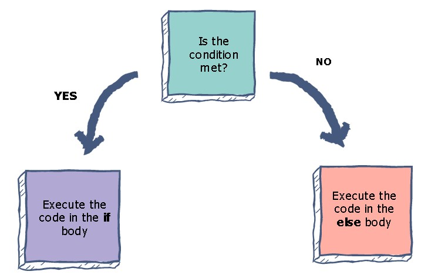

# Percabangan



## 1. Permasalahan

Pada materi sebelumnya kita telah mengenal berbagai macam operator, operator sendiri nantinya akan digunakan pada suatu statement atau pernyataan. Pastinya saat kita membuat program kita akan mendapati suatu pernyataan dan pernyataan tersebut nantinya memiliki respon yang berbeda beda jika diluar hujan maka akan kita membawa payung, jika diluar panas maka kita akan memakai topi. Maka dari itu kita butuh untuk belajar tentang materi percabangan karena nantinya akan sering kita implementasikan saat membuat suatu program.

## 2. Penjelasan Mengenai Percabangan

Oke pada kali ini kita akan membahas lebih lanjut mengenai percabangan. Percabangan sendiri biasanya digunakan untuk menentukan suatu keputusan atau kondisi tertentu, didalam sebuah kondisi biasanya ada operator yang digunakan sebagai syarat untuk memenuhi kondisi tersebut. Percabangan di java ada 2 yang pertama menggunakan if else lalu yang kedua switch-case. Mari kita lihat potongan kode dibawah.

```java
if(kondisi 1){
    jalankan pernyataan-1
}else if(kondisi 2){
    jalankan pernyataan-2
}else if(kondisi 3){
    jalankan pernyataan-3
}else{
    jalankan pernyataan default
}
```

Nah pada kasus diatas dapat kita tarik kesimpulan bahwa if else ini percabangan untuk menentukan keputusan atau pernyataan. Pada java suatu code dibaca dari atas kebawah jadi jika if pertama (kondisi 1) terpenuhi maka akan langsung masuk kedalam pernyataan-1 lalu jika kondisi pertama(kondisi 1) tidak terpenuhi maka akan lompat ke kondisi 2, jika kondisi 2 terpenuhi maka yang dijalankan adalah pernyataan ke-2, jika kondisi ke 3 terpenuhi maka yang dijalankan adalah pernyataan ke-3 dan seterusnya. Untuk else sendiri merupakan suatu kondisi dimana semua kondisi yang telah kita atur tidak ada yang sesuai, semisal kondisi 1,2,3 tidak ada yang terpenuhi, maka else lah yang dijalankan. Oke yuk lanjut membahas switch case, untuk contoh switch case pahami potongan kode berikut.

```java
int menuMakanan = 3;

    switch(menuMakanan){
        case 1:
            System.out.println("Donat");
            break;
        case 2:
            System.out.println("Es Krim");
            break;
        case 3:
            System.out.println("Kebab");
            break;
        default:
            System.out.println("Air Putih");
            break;
    }
```

Pada contoh kasus diatas switch case nantinya akan digunakan pada bagian pemilihan menu, jika user memilih menu 1, maka akan masuk case 1 nantinya akan muncul "Donat", jika user memilih menu 2, maka akan masuk pada case 2 dan nantinya akan muncul Es Krim. Jika user memasukan angka selain 1,2,3 maka secara default user akan mendapatkan Air Putih. Pada kasus diatas variabel `menuMakanan = 3` pastinya kalian bisa menebak output yang keluar apa. Yak betul! menu yang dipilih ada menu ke 3 yaitu Kebab!. Setelah kalian mengenal if-else dan switch-case ada 1 lagi yang nantinya akan sering kalian jumpai saat membuat suatu program yaitu nested-if. Dari artinya sendiri nested if merupakan suatu kondisi dimana ada if didalam if, tentunya akan sedikit membingungkan jika kalian hanya membaca penjelasan ini, oke langsung saja kita simak program dibawah ini.

```java
import java.util.Scanner;
public class HitungDiskon {
    public static void main(String[] args) {
        Scanner input = new Scanner(System.in);
        Scanner inputNum = new Scanner(System.in);
        String tanya, kodeDiskonInput ,kodeDiskon = "M4NT4PUJ1W4";
        int pembelian;

        System.out.print("Apakah Anda Memiliki Kode Diskon (Y/N) ? >> ");
        tanya = input.nextLine();
        if(tanya.equalsIgnoreCase("Y")){
            System.out.print("Masukan Kode Diskon >> ");
            kodeDiskonInput = input.nextLine();
            if(kodeDiskonInput.equals(kodeDiskon)){
                System.out.print("Berapa Banyak Barang Yang Anda Beli? >> ");
                pembelian = inputNum.nextInt();
                if(pembelian > 10){
                    System.out.println("Selamat Anda Mendapat Diskon 10%!");
                    System.out.println("Terimakasih Telah Membeli Barang Sebanyak "+pembelian);
                }else{
                    System.out.println("Selamat Anda Mendapat Diskon 5%!");
                    System.out.println("Terimakasih Telah Membeli Barang Sebanyak "+pembelian);
                }
            }else{
                System.out.println("Maaf Kode Diskon Anda Tidak Valid, Anda Tidak Jadi Dapat Diskon!");
                System.out.print("Berapa Banyak Barang Yang Anda Beli? >> ");
                pembelian = inputNum.nextInt();
                System.out.println("Terimakasih Telah Membeli Barang Sebanyak "+pembelian);
            }
        }else{
            System.out.print("Berapa Banyak Barang Yang Anda Beli? >> ");
            pembelian = inputNum.nextInt();
            System.out.println("Terimakasih Telah Membeli Barang Sebanyak "+pembelian);
        }
    }
```

Kode diatas merupakan contoh percabangan nested-if. Oke saya akan jelaskan baris kode diatas, kita membuat suatu program dimana nantinya akan melakukan pengecekan kode diskon. Kode diskon diatas memiliki kode `kodeDiskon = "M4NT4PUJ1W4"`. Untuk if else pertama anda akan ditanya apakah memiliki kode diskon? Kita disini bisa memasukan huruf Y besar atau y kecil karena menggunakan `equalsIgnoreCase` yang berguna untuk compare string (Semisal yang dimasukkan y kecil atau Y besar akan tetap dianggap sama yang penting Y/y) namun jika kita menggunakan `equals` saja maka kita harus memasukan Y karena case sensitive. Oke lanjut, jika anda memasukan Y/y maka akan lanjut pada sebuah inputan diminta memasukan kode diskon. Jika anda menjawab N/n maka akan langsung ditanya berapa barang yang anda beli lalu program akan berhenti dan anda tidak mendapatkan diskon apa apa. Contoh output.

```bash
Apakah Anda Memiliki Kode Diskon (Y/N) ? >> n
Berapa Banyak Barang Yang Anda Beli? >> 5
Terimakasih Telah Membeli Barang Sebanyak 5
```

Lalu jika anda menjawab Y/y lalu memasukan kode yang salah maka akan tetap sama yaitu tidak dapat diskon karena kode yang anda masukan tidak valid/salah. Contoh output.

```bash
Apakah Anda Memiliki Kode Diskon (Y/N) ? >> y
Masukan Kode Diskon >> mantapjiwahh
Maaf Kode Diskon Anda Tidak Valid, Anda Tidak Jadi Dapat Diskon!
Berapa Banyak Barang Yang Anda Beli? >> 20
Terimakasih Telah Membeli Barang Sebanyak 20
```

Jika anda mengetikkan kode diskon yang benar maka akan lanjut ditanya berapakah barang yang anda beli? jika lebih dari 10 maka akan dapat diskon 10% namun jika kurang dari sama dengan 10 maka hanya mendapat diskon 5%. Berikut contoh outputnya jika membeli barang kurang dari 11.

```bash
Apakah Anda Memiliki Kode Diskon (Y/N) ? >> y
Masukan Kode Diskon >> M4NT4PUJ1W4
Berapa Banyak Barang Yang Anda Beli? >> 10
Selamat Anda Mendapat Diskon 5%!
Terimakasih Telah Membeli Barang Sebanyak 10
```

Ingat potongan kode `if(pembelian > 10){` lebih dari 10. Jadi akan mendapat diskon 10% jika membeli barang 11 keatas. Contoh output membeli barang diatas 10 item.

```bash
Apakah Anda Memiliki Kode Diskon (Y/N) ? >> y
Masukan Kode Diskon >> M4NT4PUJ1W4
Berapa Banyak Barang Yang Anda Beli? >> 11
Selamat Anda Mendapat Diskon 10%!
Terimakasih Telah Membeli Barang Sebanyak 11
```

Oke itu merupakan contoh sederhana mengenai percabangan di java. Untuk selebihnya kalian bisa kembangkan sendiri dengan menggunakan operator yang lebih beragam contohnya dengan `&&, ||` dan lain lain.
