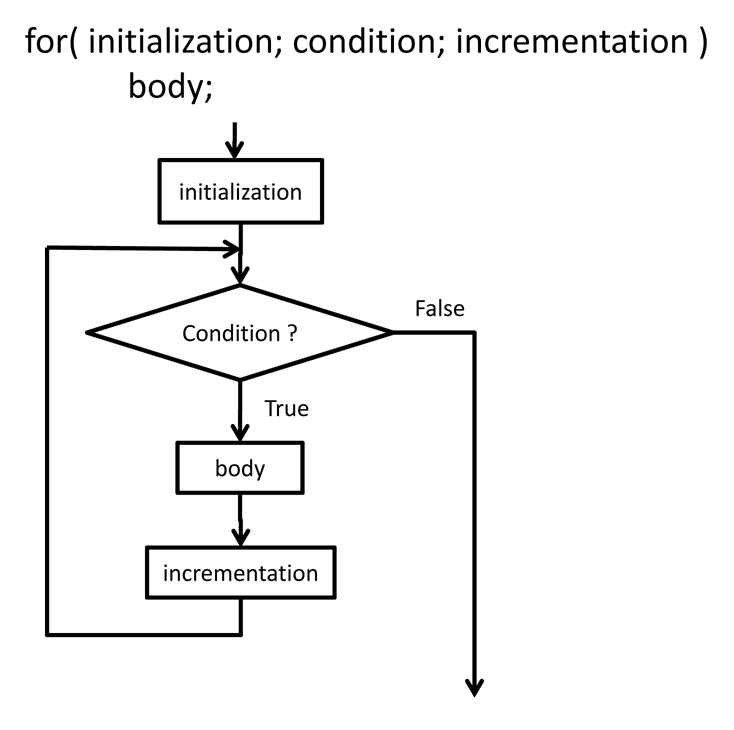
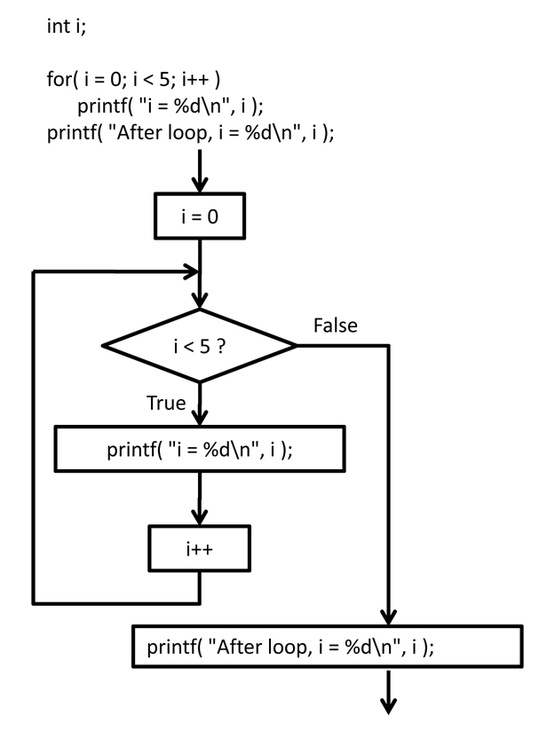
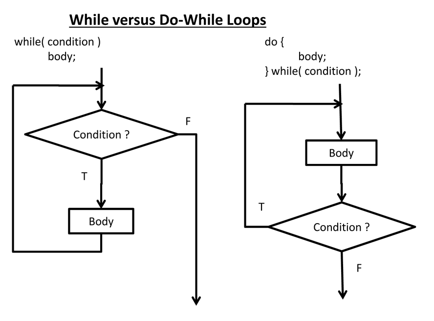

# Perulangan

## 1. Permasalahan

Kali ini kita akan membahas mengenai perulangan, saat kita ingin menjalankan suatu kode secara berulang kali tanpa mengenal apa itu perulangan maka kita pastinya akan menuliskan code berikut.

```java
System.out.println("Merdeka!!!");
System.out.println("Merdeka!!!");
System.out.println("Merdeka!!!");
System.out.println("Merdeka!!!");
System.out.println("Merdeka!!!");
```

Maka akan menghasilkan output yang berulang seperti berikut :

```bash
Output :
Merdeka!!!
Merdeka!!!
Merdeka!!!
Merdeka!!!
Merdeka!!!
```

Nah jika 5 code masih enak kan? bagaimana kalau 1000 atau 10000 perulangan? kalau kalian tidak mengenal perulangan, pastinya tangan kalian bakal capek buat copy paste kode yang berulang XD. Nah maka dari itu perulangan dibuat untuk mempermudah hidup kita.

## 2. Pembahasan

### 2.1 Loop

Sebelum lompat ke arah teknis mari kita bahas dulu konsep perulangan, perulangan sendiri memiliki 2 jenis yaitu Perulangan yang bisa dihitung menggunakan `for` dan Perulangan yang jumlahnya tidak tentu / tidak bisa dihitung biasanya menggunakan `while` atau `do-while`.

Pertama tama kita akan membahas `for`. Agar lebih jelas mari kita simak gambar dibawah.



Jika kita memperhatikan flowchart diatas pola dari `for` sendiri yang pertama tama kita memperlukan suatu inisialisasi lalu akan dicek kondisinya apakah kondisi memenuhi syarat? jika `true` maka ia akan mengeksekusi kode pada body looping `for` lalu terdapat incrementation atau penambahan lalu akan dilakukan pengecekan lagi terhadap variabel yang telah diinisialisasi pada awal tadi. Variabel yang awal tadi telah berubah valuenya karena terdapat incrementation atau penambahan. Jika value masih sesuai dengan syarat maka akan masuk ke body lagi dan loop secara terus menerus, hingga value yang ditetapkan sudah tidak lagi sesuai dengan syarat atau condition yang ada atau biasa kita sebut `false`. Jika false maka akan berhenti melakukan proses looping dan melanjutkan kode dibawahnya. Proses loop jika dituliskan dengan menggunakan kode akan seperti gambar dibawah.



Inisialisasi variabel i pertama adalah 0. Nah pada condition dilakukan pengecekan apakah i kurang dari 5? jika iya atau `true` maka eksekusi body, maka kodingan yang dibody dieksekusi. Setelah body dieksekusi maka lompat pada tahap selanjutnya yaitu incrementation atau penambahan variabel i tadi, dengan menggunakan i++ berarti i akan terus menambah valuenya 0, 1, 2, 3, 4. Nah pada tahap terakhir 4 akan diincrement dan nilai menjadi 5, nah kondisi ini tidak sesuai dengan syarat loop. Maka akan masuk ke arah `false`. Jika `false` maka akan lanjut mengeksusi kode dibawahnya dan tidak lanjut looping.

Oke mari kita lanjut membahas mengenai `while` dan `do-while`, perhatikan gambar dibawah ini



Nah setelah kalian melihat flowchart diatas untuk yang while hampir sama dengan for yaitu dilakukan pengecekan kondisi namun perbedaanya terletak pada increment, pada while kita bebas meletakkan increment atau tidak. Mari kita lihat potongan kode dibawah.

```java
int i = 0;
while(i<5){
    System.out.println("Perulangan ke "+i);
}
```

Kode diatas akan menghasilkan output yang tak terhingga atau tidak akan berhenti loop. Karena nilai i tidak pernah diincrement nah while akan mengecek i kurang dari 5 atau tidak, jika kita tidak mengincrement i maka nilai i akan selamanya 0. Dan ini nantinya akan menghasilkan infinite loop.

```bash
Output :
Perulangan ke 0
Perulangan ke 0
Perulangan ke 0
Perulangan ke 0
dst..
```

Namun beda cerita jika kita melakukan increment sesudah mencetak hasilnya, mari kita lihat kode dibawah.

```java
int i = 0;
while(i<5){
    System.out.println("Perulangan ke "+i);
    i++; //Increment i agar nilai terus bertambah.
}
```

Maka Outputnya

```bash
Output :
Perulangan ke 0
Perulangan ke 1
Perulangan ke 2
Perulangan ke 3
Perulangan ke 4
```

Oke selanjutnya kita akan membahas mengenai `do-while`. Nah perulangan dengan menggunakan `do-while` ini nantinya akan mengeksekusi setidaknya 1x proses loop, nah pada `do-while` kita akan mengeksekusi kode pada body lalu baru akan melakukan pengecekan apakah sesuai dengan kondisi `true` atau `false`, jika sesuai kondisi atau `true` maka akan dilakukan looping. Jika tidak atau `false` maka program akan mengeksekusi kode dibawahnya. Untuk lebih jelasnya mari kita lihat kode dibawah.

```java
int bulan;
    do{
        System.out.print("Masukan angka bulan kelahiran anda (1-12) >> ");
        bulan = sc.nextInt();
    }while(bulan < 1 || bulan > 12);
```

Kode diatas meminta kita untuk memasukkan bulan kelahiran kita berdasarkan angka. Pertama-tama kita memasukan angka 1 sampai 12 maka saat pada while akan dilakukan pengecekan, apakah angka yang dimasukan kurang dari 1 atau apakah angka yang dimasukan lebih dari 12. Jika kita memasukan angka 5 maka pengecekan kondisi pada while bernilai `false` karena pada kondisi while angka harus kurang dari 1 atau lebih dari 12 untuk mendapatkan nilai `true`. Mari kita lihat contoh output untuk hasil `false`.

```bash
Output :
Masukan angka bulan kelahiran anda (1-12) >> 4
BUILD SUCCESSFUL (total time: 3 seconds)
```

Sesuai dengan gambar diatas jika kondisi bernilai false maka akan mengeksekusi kode dibawahnya, berhubung tidak ada kode selanjutnya maka program berhenti atau selesai. Namun apakah yang terjadi jika kita memasukan angka kurang dari 1 atau lebih dari 12? Mari kita simak output berikut.

```bash
Output :
Masukan angka bulan kelahiran anda (1-12) >> 0
Masukan angka bulan kelahiran anda (1-12) >> 13
Masukan angka bulan kelahiran anda (1-12) >> 20
Masukan angka bulan kelahiran anda (1-12) >> 40
Masukan angka bulan kelahiran anda (1-12) >> 100
Masukan angka bulan kelahiran anda (1-12) >> 2323
Masukan angka bulan kelahiran anda (1-12) >> 29
Masukan angka bulan kelahiran anda (1-12) >> 1
BUILD SUCCESSFUL (total time: 17 seconds)
```

Nah seperti yang saya katakan sebelumnya, jika kondisi sesuai atau bernilai `true` maka program akan terus mengulang sampai mendapatkan kondisi bernilai `false`, kita memasukan bulan yang bernilai kurang dari 1 dan lebih dari 12 selama 7x, nah pada perulangan terakhir kita memasukan nilai 1 yang bernilai `false` maka proses perulangan `do-while` baru berakhir.

### 2.2 Nested Loop

Nested loop atau biasa kita sebut perulangan bersarang sering digunakan pada array multi dimensi, nested loop sendiri bisa kita kombinasikan contohnya `while-for` atau `for-for` yang paling umum digunakan adalah nested `for`. Untuk lebih jelasnya mari kita simak kode dibawah.

```java
for (int i = 1; i <= 5; i++){
    for(int j = 1; j <= 3; j++){
        System.out.println("Perulangan i="+i+", j="+j);
    }
}
```

```bash
Output :
Perulangan i=1, j=1
Perulangan i=1, j=2
Perulangan i=1, j=3
Perulangan i=2, j=1
Perulangan i=2, j=2
Perulangan i=2, j=3
Perulangan i=3, j=1
Perulangan i=3, j=2
Perulangan i=3, j=3
Perulangan i=4, j=1
Perulangan i=4, j=2
Perulangan i=4, j=3
Perulangan i=5, j=1
Perulangan i=5, j=2
Perulangan i=5, j=3
```

Nah pada nested loop sendiri konsepnya sama seperti for biasa, kita akan meloop i untuk pertama kali, lalu melakukan proses looping j, nah pada j sendiri akan dilakukan looping sebanyak 3x terlebih dahulu sampai kondisi j bernilai `false`, setelah bernilai `false` maka akan lanjut kode dibawahnya yaitu kembali lagi proses loop i seterusnya.

<!-- All Image Source : https://www.cs.uic.edu -->
