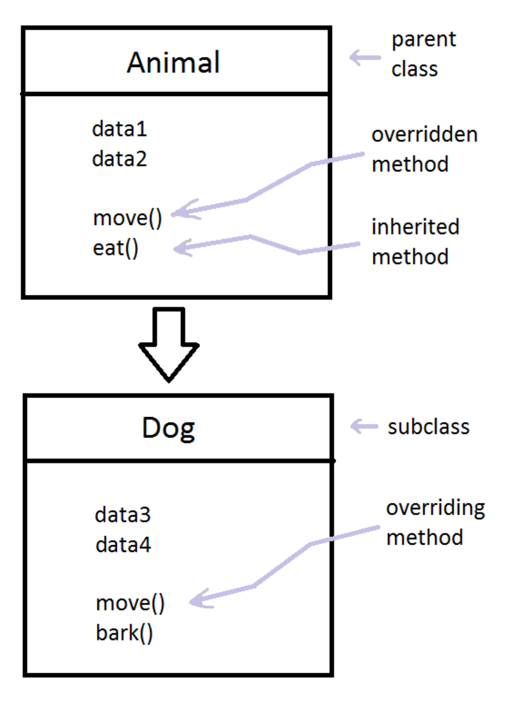

# Overriding

## 1. Permasalahan
Terkadang saat membuat suatu program kita membuat suatu method yang sama kegunaanya namun terkadang isinya berbeda. Pada penjelasan sebelumnya kita telah mengenal apa itu OOP dll. Pada implementasinya OOP sendiri fokus kepada pembuatan objek yang intinya objek tersebut saling berhubungan. Misalnya Hewan, hewan terdiri dari banyak objek yang berbeda beda baik kucing, ikan, burung. Ketiga objek tersebut merupakan hewan, namun cara makan, cara bernafas, dan cara berjalan mereka berbeda. Nah maka dari itu ada salah satu metode bernama overriding yang nantinya kita dapat menulis kembali method yang ada parent class dan kita terapkan pada subclass.

## 2. Penjelasan Overriding

Pada pembahasan sebelumnya kita telah mengenal apa itu Overloading. Dan kali ini kita akan mengenal overriding, overriding sendiri adalah suatu konsep OOP dimana konsep ini intinya adalah mewarisi sifat dari parent class-nya. Oke agar lebih mudah dalam memahami mari kita lihat gambar dibawah.

<center>

</center>

Pada gambar diatas kita memiliki 2 buah class yang pertama adalah Animal, animal disini sebagai parent class nya. Lalu untuk class kedua adalah Dog yaitu sebagai subclass nya. Terdapat method move pada animal dan ada methode move juga pada Dog. Method move pada Animal ini disebut Overriden Method dan jika pada Dog disebut dengan Overriding Method. Pada method kedua class move digunakan kembali dan inilah yang disebut dengan overriding. Kita mendapat pewarisan dari parent class, namun kita masih bisa mengganti isinya sesuai dengan kebutuhan kita.

## 3. Implementasi Overriding pada Java

Implementasi contoh penjelasan diatas adalah sebagai berikut pertama tama kita harus membuat class parent nya terlebih dahulu

``` java
// Animal.java

public class Animal {
    void move(){
        System.out.println("Binatang bergerak sesuai dengan caranya bergerak");
    }
}
```
Disini kita memiliki parent class bernama animal yang nantinya methodnya akan digunakan kembali pada superclass. Mari kita buat superclassnya

```java
// Dog.java

public class Dog extends Animal{
    @Override
    public void move(){
        System.out.println("Anjing bergerak dengan menggunakan kakinya");
    }

    void bark(){
        System.out.println("Woof-woof");
    }
}
```
Anjing pasti bisa bergerak maka kita cukup mengambil method yang sudah disediakan pada parent class dan mengoverride nya ke Dog. Kenapa bark tidak dimasukan pada Animal? dikarenakan tidak semua hewan bisa menggonggong. Kita tahu bahwa parent class memiliki sifat universal yaitu semua hewan bisa melakukannya contoh : bergerak, makan, minum dll. Untuk Access Modifier pada Overriding ini pada subclass tidak boleh lebih kecil sifatnya dari parent. Pada Class Animal sendiri kita tahu bahwa sifat dari method move merupakan default, maka dari itu pada sub classnya (Dog)  kita bisa menggunakan default, protected, public. Karena itu merupakan salah satu sifat dari konsep OOP overriding ini.