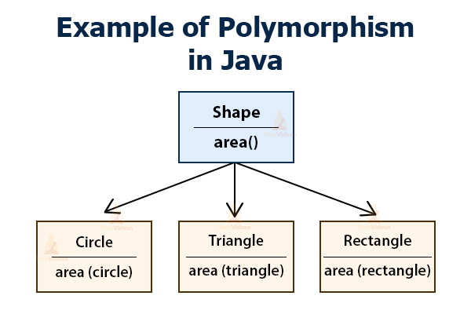

# Polymorphism

## 1. Penjelasan

Polimorfisme sendiri memiliki artian banyak bentuk. Pada konsep pemrograman OOP Polimorfisme merupakan suatu objek yang memiliki banyak bentuk. Permisalan kita ambil pada buah. Kita dapat memakan semua jenis buah, namun cara memakan buah itu berbeda. Apel bisa langsung kita makan tanpa mengupas kulitnya, sedangkan jika nanas harus dikupas terlebih dahulu. Nah pada study case kali ini kita memiliki Object bernama Manusia yang memiliki sebuah method makanBuah dengan parameter sebuah object yaitu Buah (Apel, Nanas, Salak). Lalu didalam method makanBuah baru dideteksi buahnya itu apa, apakah apel, nanas atau salak. Kemudian method tersebut bisa menentukan cara memakannya, jika nanas harus dikupas terlebih dahulu, jika apel langsung dimakan dst.

Polimorfisme sendiri melibatkan berbagai konsep OOP yang telah kita pelajari sebelumnya, seperti objek, enkapsulasi, inheritance dan lain lain. Dan pada java polimorfisme memiliki 2 jenis yaitu Static Polymorphism dan Dynamic Polymorphism, perbedaan dari kedua jenis polimorfisme ini adalah cara membuatnya, jika statis atau static polymorphism menggunakan method overloading. Lalu jika dinamis atau dynamic polymorphism menggunakan method overriding.

## 2. Implementasi Coding

### 2.1 Static Polymorphism

Pada overloading sendiri memiliki ciri ciri bahwa pada suatu class terdapat method dengan nama yang sama lalu tipe data dan parameter berbeda, inilah yang dinamakan method overloading



Pada gambar diatas terdapat berbagai Object

```java
public class Koceng {
    void bersuara(){
        System.out.println("Meong");
    }

    void bersuara(int num){
        for(int i=0;i<num;i++){
            System.out.println("Meong");
        }
    }

    public static void main(String[] args) {
        Koceng bintik = new Koceng();
        bintik.bersuara();
        bintik.bersuara(5);
    }
}
```

Oke pada kodingan diatas terdapat method yang sama namun parameter yang diminta berbeda, untuk parameter bersuara yang pertama kosong atau tidak membutuhkan sedangkan parameter kedua memiliki parameter num yang nantinya bisa kita inputkan sesuai dengan yang kita mau. Nah inilah yang disebut dengan polimorfisme statis.

### 2.2 Dynamic Polymorphism

Pada dynamic polymorphism kita akan mengimplementasikan konsep overriding. Jika anda sedikit lupa mengenai konsep overriding silahkan [Baca Disini](overriding.md).

```java
package javaapp;
public class Kendaraan {
    public void bergerak(){
        System.out.println("Ngueengg~");
    }
}
```

Pada awalnya membuat class parent lalu kita implementasikan.

```java
package javaapp;
public class Sepeda extends Kendaraan{
    @Override
    public void bergerak(){
        System.out.println("Sepeda bergerak dengan cara dikayuh terlebih dahulu");
    }
}
```

Buat main class nya

```java
public class MainKendaraan {
    public static void main(String[] args) {
        Kendaraan k = new Sepeda();
        k.bergerak();
        k = new Kendaraan();
        k.bergerak();
    }
}
```

```bash
Output :
Sepeda bergerak dengan cara dikayuh terlebih dahulu
Ngueengg~
```

Nah itu merupakan salah satu contoh dynamic polymorphism, kita dapat mengimplementasikan bergerak dengan cara yang berbeda beda contohnya jika mobil diinjak pedal gasnya jika perahu kayu menggunakan dayung dan lain lain.

### 2.3 Instance of

Pada polimorfisme kita juga dapat melakukan pengecekan ini termasuk dalam class mana dan bisa memilih aksi sesuai dengan filter class tersebut, oke langsung saja ke implementasi coding supaya tidak bingung. Seperti biasa kita pertama tama membuat class parent terlebih dahulu yang nantinya akan diimplementasikan pada class child.

```java
package polimorfisme;

public class Karyawan {
    protected String nama;
    public String getDataKaryawan(){
        return "Nama = "+nama;
    }
}
```

Class parent kedua

```java
package polimorfisme;

public interface Gaji {
    public int getTotalGaji();
}
```

Membuat child class.

```java
package polimorfisme;

public class KaryawanMagang extends Karyawan{
    private int durasiMagang;

    public KaryawanMagang(String nama,int durasiMagang) {
        this.nama = nama;
        this.durasiMagang = durasiMagang;
    }

    public int getDurasiMagang() {
        return durasiMagang;
    }

    public void setDurasiMagang(int durasiMagang) {
        this.durasiMagang = durasiMagang;
    }

    @Override
    public String getDataKaryawan(){
        String info = super.getDataKaryawan()+"\n";
        info += "Menjadi Karyawan magang selama " +durasiMagang+ " Bulan";
        return info;
    }
}
```

Membuat child class kedua

```java
package polimorfisme;

public class PegawaiTetap extends Karyawan implements Gaji{
    private int gaji;

    public PegawaiTetap(String nama,int gaji) {
        this.nama = nama;
        this.gaji = gaji;
    }

    public int getGaji() {
        return gaji;
    }

    public void setGaji(int gaji) {
        this.gaji = gaji;
    }

    @Override
    public int getTotalGaji() {
        return(int)(gaji+0.05*gaji);
    }

    @Override
    public String getDataKaryawan(){
        String info = super.getDataKaryawan()+"\n";
        info += "Menjadi Karyawan tetap dengan gaji " +gaji;
        return info;
    }
}
```

Terlihat perbedaan kedua child class yaitu pada class yang diimplementasi sesuai kebutuhan. Jika karyawan magang tidak mendapat gaji, jika pegawai tetap mendapatkan gaji. Lalu sekarang kita membuat class yang berguna untuk filter antara Karyawan Magang dan Pegawai Tetap.

```java
package polimorfisme;

public class Bos {
    public void tampilSemuaKaryawan(Karyawan k){
        System.out.println(""+k.getDataKaryawan());
        if(k instanceof PegawaiTetap){
            System.out.println("Perlu digaji nih");
        }else{
            System.out.println("Tidak Mendapat Gaji");
        }
    }
}
```

Pada class bos sendiri terdapat suatu method yang meminta parameter objek, lalu objeknya dicek bagian yang mana. Apakah pegawai magang? jika iya gadapat gaji, jika pegawai tetap maka dia mendapatkan gaji. Oke mari kita buat main class nya.

```java
package polimorfisme;

public class MainKaryawan {
    public static void main(String[] args) {
        Bos boss = new Bos();
        PegawaiTetap pt = new PegawaiTetap("Sultan Achmad", 800);
        boss.tampilSemuaKaryawan(pt);
        KaryawanMagang km = new KaryawanMagang("Abdurrasyid M",6);
        boss.tampilSemuaKaryawan(km);
    }
}
```

```bash
Output:
Nama = Sultan Achmad
Menjadi Karyawan tetap dengan gaji 800
Perlu digaji nih
Nama = Abdurrasyid M
Menjadi Karyawan magang selama 6 Bulan
Tidak Mendapat Gaji
```

Dengan menggunakan instance of kita dapat melakukan filter antar objek dan membedakan perlakuan yang diberikan. Jika objek A mendapat apa, jika Objek B mendapat apa. Jadi sesuai kebutuhan saja.
